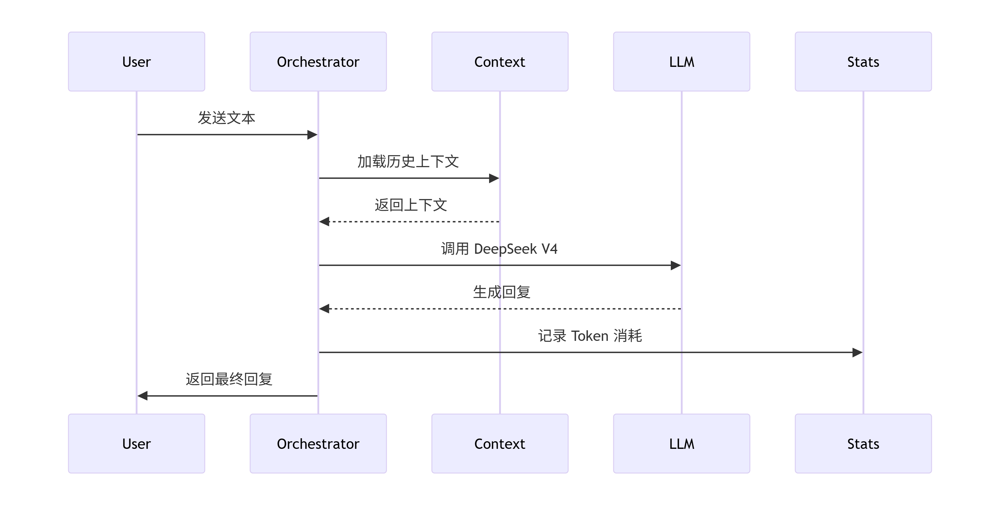
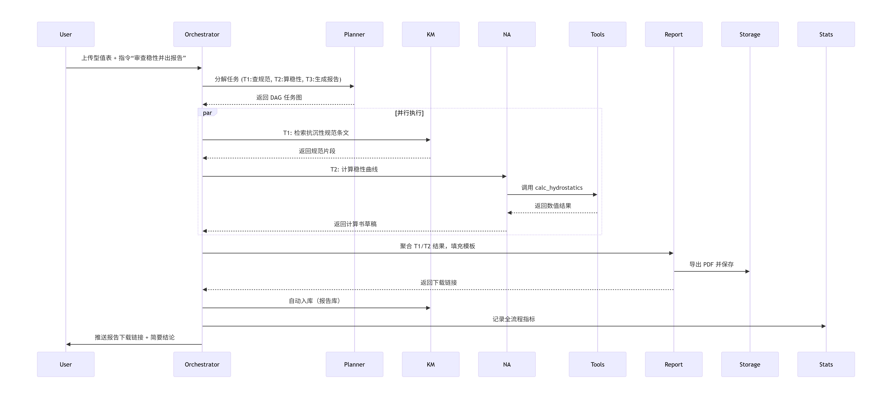

# 总体设计
### 项目框架设计
- **多端交互层**：支持哪些终端
- **智能体编排层**：意图识别、任务规划、多智能体协同机制
- **业务智能体层**：如何注册、发现、通信
- **能力中台层**：知识图谱、RAG、仿真引擎、模型服务等能力组件的设计
- **数据底座层**：数据类型、存储方案、实时流处理架构  
- **会话状态（Session FSM）**

- **同步简单对话流（未开启工具代理）**

- **复杂专业任务流（子代理 + 工具 + 报告生成）**  

### 各模块初步概念描述
**基础AI与交互能力**
- **基础对话功能**：支持调用知识库和联网搜索，实现自然对话，具备上下文管理能力。参数可调，知识库调用与联网搜索可独立开关。
- **工具调用**：支持灵活的工具调用机制，开发时需预留良好扩展接口，便于后续新增工具。
- **子代理编排**：通过“项目经理”代理负责任务分配协调，“软件工程师”负责代码编写，“船舶工程师”处理船舶专业问题，“嵌入式工程师”负责硬件开发等。各子代理专长不同，相互配合完成复杂任务。
- **数据统计功能**：实时记录并统计每日/每周/每月/每年的 token 消耗、知识库调用次数、大模型调用次数、联网搜索次数、各类工具调用次数、子代理编排次数等指标。
- **代办事项记录功能**：支持用户记录和管理个人及项目相关的待办事项。

**知识管理与报告系统**
- **知识库功能**：支持用户自行上传文件，按不同模块分库保存；支持每日自动或手动将本地生成的调研报告导入知识库。
- **每日调研报告功能**：前期由用户联网后手动点击“总结”按钮触发，后续可由服务器每日自动生成并推送。报告需按规范格式排版（包含摘要、关键词、参考文献等），附录提供可跳转至原文的链接。生成后导出为 PDF，自动存入“调研报告”模块并导入知识库。历史报告本地全部保留（用户可自行删除），未来支持云端存储并随时下载特定日期的报告。

**船舶专业设计工具**
- **规范合规性审查**：基于知识库中的规范文件，对用户输入的设计参数或图纸进行自动审查，标注不合规之处，生成规范格式的审查报告（PDF 导出），同时提供具体修改意见和规范条文溯源。
- **图纸绘制**：根据用户提供的船舶型值表和首尾端结构，自动调用 CAD 等工具绘制型线图，并进行曲线光顺度检查与修正。
- **船型改造**：基于母船型线图，结合用户对快速性、稳性、抗沉性等性能的需求进行优化改造。完成后可导出子船的型线图、型值表，并提供改造依据。
- **船舶性能计算**：根据提供的型值表、型线图等信息，进行静水力性能计算、邦戎曲线绘制、静水力曲线绘制及其他必要参数计算，需考虑误差减小方法。数据不足时明确提示用户补充所需数据，并生成完整计算报告。